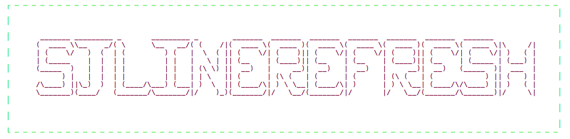

  

- **what's this?**
***
A easy customizable shape pull-to-refresh control [中文介绍](./README-chiness.md)


- **how to use**
***
```
let aPath = Bundle.main.path(forResource: "HHMedic", ofType: "plist")!
let aConfig = SJRefreshConfig(plist: aPath)
tableView.sj_header = SJRefreshView(config: aConfig) { [weak self] in
  // do your refresh
}

```

- **how to create shape**
***
only support line shape now.

[PaintCode](https://www.paintcodeapp.com) is a app that can turn drawings into Objective-C or swift code.


```
- drawing lines whatever you want;
- paste the points that PaintCode genarated into your own plist(startPoints, endPoint);
- the refreshView's maxWidth is equal to the max x of points in step 2. so does the maxHeight.
```

- **Installation**
***
**CocoaPods**

[CocoaPods](http://cocoapods.org/) is a dependency manager for Cocoa projects.
```
$ gem install cocoapods
```

To integrate Alamofire into your Xcode project using CocoaPods, specify it in your Podfile
:
```
pod 'SJLineRefresh', '~> 1.1.1'
```
Then, run the following command:
```
$ pod install
```

**Carthage**

[Carthage](https://github.com/Carthage/Carthage) is a decentralized dependency manager that builds your dependencies and provides you with binary frameworks.
You can install Carthage with [Homebrew](http://brew.sh/) using the following command:
```
$ brew update
$ brew install carthage
```
To integrate Alamofire into your Xcode project using Carthage, specify it in your Cartfile :
```
github "515783034/SJLIineRefresh" ~> 1.1.1
```
Run carthage update to build the framework and drag the built SJLineRefresh.framework into your Xcode project.

- **Reference**
***
[MJRefresh](https://github.com/CoderMJLee/MJRefresh)

[CBStoreHouseRefreshControl](https://github.com/coolbeet/CBStoreHouseRefreshControl)
